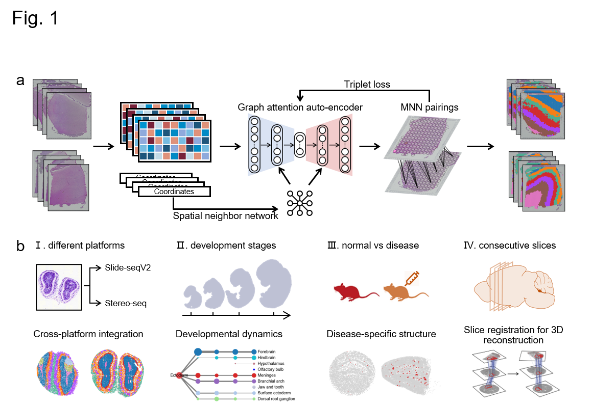

# STAligner



## Overview

STAligner is designed for alignment and integration of spatially resolved transcriptomics data.

**a**. STAligner first normalizes the expression profiles for all spots and constructs a spatial neighbor network using the spatial coordinates. STAligner further employs a graph attention auto-encoder neural network to extract spatially aware embedding, and constructs the spot triplets based on current embeddings to guide the alignment process by attracting similar spots and discriminating dissimilar spots across slices. STAligner introduces the triplet loss to update the spot embedding to reduce the distance from the anchor to positive spot, and increase the distance from the anchor to negative spot. The triplet construction and auto-encoder training are optimized iteratively until batch-corrected embeddings are generated. **b**. STAligner can be applied to integrate ST datasets to achieve alignment and simultaneous identification of spatial domains from different biological samples in (**a**), technological platforms (I), developmental (embryonic) stages (II), disease conditions (III) and consecutive slices of a tissue for 3D slice alignment (IV).


## Installation
The STAligner package is developed based on the Python libraries [Scanpy](https://scanpy.readthedocs.io/en/stable/), [PyTorch](https://pytorch.org/) and [PyG](https://github.com/pyg-team/pytorch_geometric) (*PyTorch Geometric*) framework, and can be run on both GPU and CPU. We recommend running the package on GPU first.


First clone the repository. 

```
git clone https://github.com/zhoux85/STAligner.git
cd STAligner
```

It's recommended to create a separate conda environment for running STAligner:

```
#create an environment called env_STAligner
conda create -n env_STAligner python=3.8

#activate your environment
conda activate env_STAligner
```

Install all the required packages.

```
pip install -r requiements.txt
```

Install STAligner.

```
python setup.py build
python setup.py install
```


## Tutorials

Three step-by-step tutorials are included in the `Tutorial` folder to show how to use STAligner.

- Tutorial 1: Integrating adjacent DLPFC slices (10x Visium)
- Tutorial 2: Integrating slices across sequencing platforms (Slide-seqV2 and Stereo-seq)

- Tutorial 3: Spatial domain guided 3D slices alignment (Slide-seq)


## Support

If you are having issues, please contact [xzhou@amss.ac.cn](mailto:zhoux85@mail2.sysu.edu.cn). 


## Citation
Xiang Zhou, Kangning Dong, and Shihua Zhang. "Integrating spatial transcriptomics data across different conditions, technologies, and developmental stages". bioRxiv, 2022.

